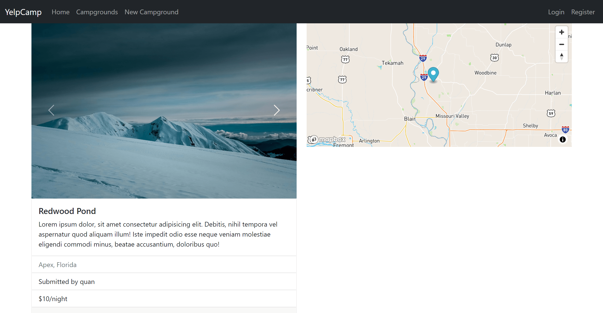

# Yelp Camp

[View Live Site](https://secret-oasis-68382.herokuapp.com/)

A massive fullstack web application act like a social media where users can share campgrounds information.

# Features

- Scalable with MVC model
- User Authentication and Authorization
- User can do full CRUD operation on campgrounds, reviews after logged in
- Passwords are stored safety with salt and hash
- Map API integration
- Database seeding

## Preview Images

&nbsp;
&nbsp;
&nbsp;

## Tech stack

- [Express](https://expressjs.com/)
- [MongoDB](https://www.mongodb.com/)
- [Passport](https://www.passportjs.org/)
- [Mapbox](https://www.mapbox.com/)
- [Cloudinary](https://cloudinary.com/)
- [EJS](https://ejs.co/)
- [Bootstrap][https://getbootstrap.com/]
- [Mongoose](https://mongoosejs.com/)
- [Joi](https://joi.dev/)
- [Helmet](https://helmetjs.github.io/)

## Show your support

Give a ⭐️ if you like this project!

## License

[MIT](LICENSE)
